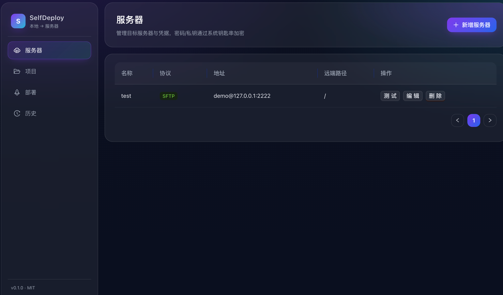
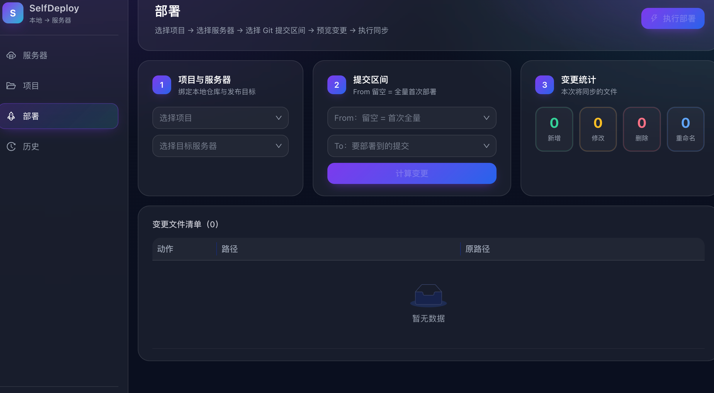
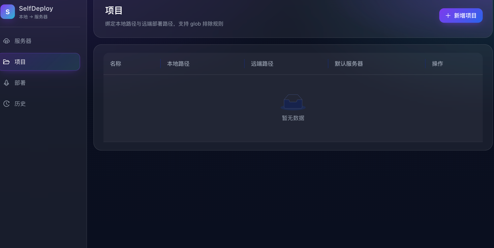

# SelfDeploy

本地项目快速部署到服务器的桌面工具。当前主线为 **macOS / Windows Tauri v2 + Rust + React + TypeScript**；Electron 仅作为 legacy 基线保留。应用使用 **SFTP/FTP** 上传，通过 **Git 提交区间** 识别变更并增量同步。

> 📚 完整设计文档见 [docs/](./docs/README.md)：需求、技术选型、架构、核心流程、安全设计、里程碑、依赖清单。

## 仓库组织（Tauri 双平台）

当前仓库已进入 Tauri 双平台组织：

| 目录 | 角色 |
|---|---|
| `apps/mac-tauri/` | macOS + Tauri 应用壳（当前默认入口） |
| `apps/win-tauri/` | Windows + Tauri 应用壳 |
| `apps/mac-electron/` | macOS + Electron legacy 回退壳 |
| `apps/shared-renderer/` | 双端共享的 React 渲染层 |
| `packages/tauri-core/` | Win/Mac Tauri 共享 Rust 后端 |
| `packages/domain/` | 纯业务模型与用例接口 |
| `packages/ipc-contract/` | 双端共享 IPC 协议与类型 |
| `packages/platform-adapter/` | 统一运行时 API 适配层 |
| `packages/testkit/` | 跨端测试支撑与 fixture |

> 详细执行路径见 [docs/09-repo-organization-dual-framework.md](./docs/09-repo-organization-dual-framework.md)。

## 功能

- 服务器管理（SFTP/FTP，密码/私钥；凭据加密存于系统钥匙串）
- 项目管理（本地路径 + 远端部署路径 + 排除规则）
- Git 提交选择 + 文件差异预览（A/M/D/R）
- 部署执行（M5 ✅ 临时目录 + rename 原子切换 + 实时日志流）、部署历史与回滚（M6）

## 应用截图

### 服务器管理



### 部署执行



### 项目管理



## 技术栈

| 层 | 选型 |
|---|---|
| 桌面框架 | Tauri v2（macOS / Windows 主线） |
| 渲染层 | React 18 + Vite + Ant Design 5 |
| 桌面后端 | Rust + Tauri commands + rusqlite + ssh2/ftp |
| 同步协议 | Rust `ssh2` / `ftp` |
| 凭据安全 | Windows DPAPI / macOS Keychain |
| 校验 | Rust `serde` + 渲染端表单校验 |

> Electron 仅保留为 legacy 回退基线，相关目录与脚本已在下方目录结构和开发命令中标明。

## 目录结构

```
apps/
├── mac-tauri/        # macOS Tauri 壳（当前默认入口）
├── win-tauri/        # Windows Tauri 壳
├── mac-electron/     # macOS Electron legacy 壳
└── shared-renderer/  # 双端共享 React 渲染层（当前主线）
packages/
├── tauri-core/       # Win/Mac Tauri 共享 Rust 后端
├── domain/           # 共享业务模型与类型
├── ipc-contract/     # 共享 IPC 协议定义
└── platform-adapter/ # 运行时适配层
```

## 开发

### 快速启动

| 命令 | 用途 |
|---|---|
| `npm install` | 安装前端、Tauri CLI 与 Rust 侧依赖 |
| `npm run dev` | macOS Tauri 开发启动（需要 Rust 工具链） |
| `npm run dev:tauri` | 同 `npm run dev` |
| `npm run dev:mac` | macOS Tauri 开发入口 |
| `npm run dev:win` | Windows Tauri 开发入口 |
| `npm run legacy:dev` | legacy Electron 回退启动 |
| `npm run legacy:mac` | macOS Electron legacy 回退启动 |
| `npm run rebuild:dev` | legacy Electron native 依赖重建 |
| `npm run lint` | 主 + 渲染双 `tsc --noEmit`，提交前必跑 |
| `npm run build` | macOS Tauri 打包（需要 Rust 工具链） |
| `npm run build:mac` | macOS Tauri 打包 |
| `npm run build:win` | Windows Tauri 打包 |
| `npm run package:mac` | macOS Tauri 打包并归集到 `release/final/` |
| `npm run package:win` | Windows Tauri 打包并归集到 `release/final/` |
| `npm run legacy:build` | legacy Electron 编译主进程 + 渲染产物 |
| `npm test` | Vitest 单元测试 |

### macOS

```bash
npm install
npm run dev           # macOS Tauri 开发
npm run package:mac   # 输出 app/dmg
```

### Windows（x64）

```bash
npm install           # 需要 Visual Studio Build Tools (C++) + Python 3
npm run dev:win       # Tauri 开发
npm run package:win   # Tauri 打包
```

> ⚠️ **Windows 编译前置**：Tauri 打包需要 Rust MSVC 工具链；如 legacy Electron native 依赖编译报错，安装 [Visual Studio Build Tools](https://visualstudio.microsoft.com/visual-cpp-build-tools/)（勾选 "Desktop development with C++"）+ Python 3。

### 本地联调远端服务器（SFTP + FTP，零配置）

```bash
docker compose -f docker/test-servers/docker-compose.yml up -d
# SFTP  127.0.0.1:2222  demo / demo123  remoteBasePath=/upload
# FTP   127.0.0.1:2121  demo / demo123  remoteBasePath=/
```

详见 [docker/test-servers/README.md](./docker/test-servers/README.md)。

## 构建打包

```bash
npm run build        # Tauri 打包
npm run package      # 默认 macOS Tauri 打包并归集
npm run package:mac  # 输出 app/dmg，并复制安装包到 release/final/
npm run package:win  # 输出 Windows MSI/NSIS，并复制安装包到 release/final/
```

最终发布安装包统一放在 `release/final/`，命名格式为：

```text
<Project>-<Version>-<Framework>-<Platform>-<Arch>-<Kind>.<ext>
```

同目录会生成 `manifest.json` 与 `manifest.md`，记录项目名、版本、框架、系统、架构、文件大小和 SHA-256。

## 里程碑

| 阶段 | 状态 | 说明 |
|---|---|---|
| M1 脚手架 | ✅ | Tauri + React + SQLite + IPC 打通 |
| M2 服务器管理 | ✅ | CRUD + 真实 SFTP/FTP 连接测试 + 编辑入口 |
| M3 项目管理 | ✅ | CRUD + 目录选择 |
| M4 Git 集成 | ✅ | 提交列表 + diff |
| M5 部署执行 | ✅ | 上传/删除/临时目录原子切换、进度与日志流 |
| M6 历史与回滚 | ✅ | 历史筛选、文件级清单、反向 diff 一键回滚 |
| M7 增强 | ✅ | `.deployignore`、部署前后 Hook、并发上传、日志落盘、FTP 端到端验证 |
| M8 Tauri 迁移 | ✅ | T0-T7 完成：Tauri 成为默认运行时，部署增强与发布脚本已收口 |
| M9 macOS Tauri | ✅ | macOS Tauri 壳接入共享 Rust core，`dev/build/package:mac` 切换到 Tauri |

## 安全说明

- 密码与私钥**不会**以明文写入 SQLite，Windows 使用 DPAPI，macOS 使用 Keychain。
- Tauri command 入参通过 `serde` 结构体反序列化与领域校验处理。
- 默认推荐 SFTP；选择 FTP 时 UI 会有提示（M2 接入时启用）。
